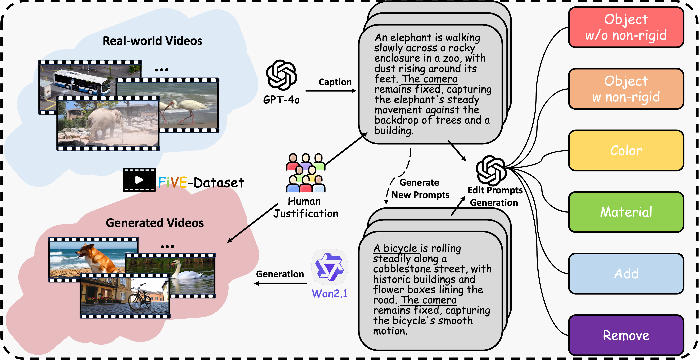
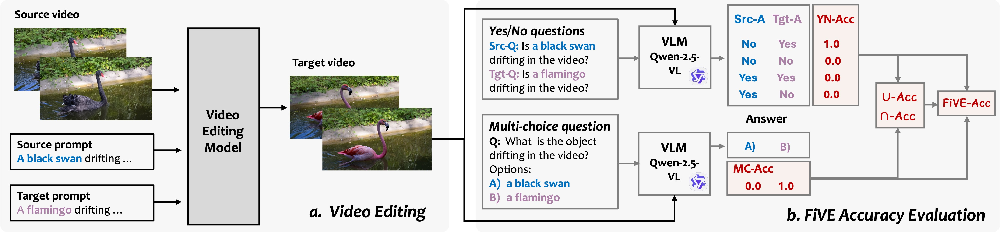
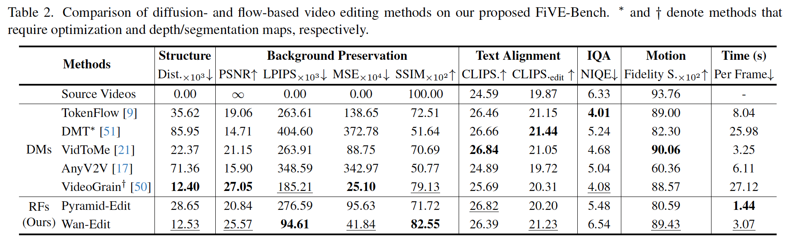
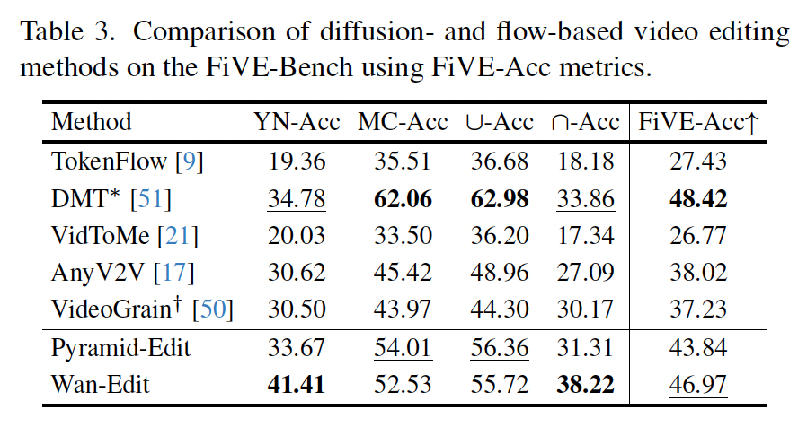

# [FiVE-Bench](https://arxiv.org/abs/2503.13684) (ICCV 2025)

[FiVE-Bench: A Fine-Grained Video Editing Benchmark for  Evaluating Emerging Diffusion and Rectified Flow Models](https://arxiv.org/abs/2503.13684)

> [Minghan Li](https://scholar.google.com/citations?user=LhdBgMAAAAAJ&hl=en)<sup>1*</sup>, [Chenxi Xie](https://openreview.net/profile?id=%7EChenxi_Xie1)<sup>2*</sup>, [Yichen Wu](https://scholar.google.com/citations?hl=zh-CN&user=p53r6j0AAAAJ&hl=en)<sup>13</sup>, [Lei Zhang](https://scholar.google.com/citations?user=tAK5l1IAAAAJ&hl=en)<sup>2</sup>, [Mengyu Wang](https://scholar.google.com/citations?user=i9B02k4AAAAJ&hl=en)<sup>1†</sup><br>
> <sup>1</sup>Harvard University <sup>2</sup>The Hong Kong Polytechnic University <sup>3</sup>City University of Hong Kong<br>
> <sup>*</sup>Equal contribution <sup>†</sup>Corresponding Author

💜 [Leaderboard (coming soon)]() &nbsp; | &nbsp; 
💻 [GitHub](https://github.com/MinghanLi/FiVE-Bench) &nbsp; | &nbsp;
🤗 [Hugging Face](https://huggingface.co/datasets/LIMinghan/FiVE-Fine-Grained-Video-Editing-Benchmark) &nbsp; 

📝 [Project Page](https://sites.google.com/view/five-benchmark) &nbsp; | &nbsp;
📰 [Paper](https://arxiv.org/abs/2503.13684) &nbsp; | &nbsp;
🎥 [Video Demo](https://sites.google.com/view/five-benchmark) &nbsp;





---
## 📝 TODO List
- [🔜] Add leaderboard support  
- [🔜] Add `Wan-Edit` demo page on HF
- [✅ Aug-26-2025] Fix two issues: mp4_to_frames_ffmpeg and skip_timestep=17
- [✅ Aug-05-2025] Release [`Wan-Edit'](models/wan-edit/) implementation  
- [✅ Aug-05-2025] Release [`Pyramid-Edit`](models/pyramid-edit/) implementation  
- [✅ Aug-02-2025] Add Wan-Edit results to HF for eval demo
- [✅ Aug-02-2025] Evaluation code released 
- [✅ Mar-31-2025] Dataset uploaded to Hugging Face   


## 📚 Table of Contents

- [FiVE-Bench Overview](#-five-bench-overview)
- [Running Your Model on FiVE-Bench](#running-your-model-on-five-bench)
  - [Step 1: Download the Dataset and Set Up Evaluation Code](#️-step-1-download-the-dataset-and-set-up-evaluation-code)
  - [Step 2: Apply Your Video Editing Method](#-step-2-apply-your-video-editing-method)
  - [Step 3: Evaluate Editing Results](#-step-3-evaluate-editing-results)
- [Evaluate Editing Results](#-step-3-evaluate-editing-results)
  - [Conventional Metrics](#-1-conventional-metrics-across-six-key-aspects)
  - [FiVE-Acc: VLM-Based Metric](#-2-five-acc-a-vlm-based-metric-for-editing-success)
- [Citation](#-citation)
- [Acknowledgement](#️-acknowledgement)


---

## 📦 FiVE-Bench Overview


The FiVE-Bench dataset offers a rich, structured benchmark for fine-grained video editing. The dataset includes ***420*** high-quality source-target prompt pairs spanning ***six fine-grained video editing*** tasks:
  1. Object Replacement (Rigid)
  2. Object Replacement (Non-Rigid)
  3. Color Alteration
  4. Material Modification
  5. Object Addition
  6. Object Removal


---
## Running Your Model on FiVE-Bench



---
### ⬇️ Step 1: Download the Dataset and Set Up Evaluation Code

- Download the dataset from Hugging Face:  🔗 [FiVE-Bench on Hugging Face](https://huggingface.co/datasets/LIMinghan/FiVE-Fine-Grained-Video-Editing-Benchmark)

- Follow the instructions in [Installation Guide](INSTALL.md) to download the dataset and install the evaluation code (`FiVE_Bench`).

- Place the downloaded dataset in the directory: `./FiVE_Bench/data`. The data structure should looks like:

  ```json
  📁 /path/to/code/FiVE_Bench/data
  ├── 📁 assets/
  ├── 📁 edit_prompt/
  │   ├── 📄 edit1_FiVE.json
  │   ├── 📄 edit2_FiVE.json
  │   ├── 📄 edit3_FiVE.json
  │   ├── 📄 edit4_FiVE.json
  │   ├── 📄 edit5_FiVE.json
  │   └── 📄 edit6_FiVE.json
  ├── 📄 README.md
  ├── 📦 bmasks.zip 
  ├── 📁 bmasks 
  │   ├── 📁 0001_bus
  │       ├── 🖼️ 00001.jpg
  │       ├── 🖼️ 00002.jpg
  │       ├── 🖼️ ...
  │   ├── 📁 ...
  ├── 📦 images.zip 
  ├── 📁 images
  │   ├── 📁 0001_bus
  │       ├── 🖼️ 00001.jpg
  │       ├── 🖼️ 00002.jpg
  │       ├── 🖼️ ...
  │   ├── 📁 ...
  ├── 📦 videos.zip 
  ├── 📁 videos
  │   ├── 🎞️ 0001_bus.mp4
  │   ├── 🎞️ 0002_girl-dog.mp4
  │   ├── 🎞️ ...
  ```


---
### 🛠️ Step 2: Apply Your Video Editing Method

Use your video editing method to edit the FiVE-Bench videos based on the provided text prompts and generate the corresponding edited results.


Example implementations of our proposed rectified flow (RF)-based video editing methods are provided provided in the [`models/`](models/) directory:
  
    - **[Pyramid-Edit](models/README.md#pyramid-edit)**: Diffusion-based video editing using Pyramid-Flow architecture

    - **[Wan-Edit](models/README.md#wan-edit)**: Rectified flow-based video editing with Wan2.1-T2V-1.3B model
           
  
#### Quick Start with Provided Models
  
  **Run Pyramid-Edit:**
  ```bash
  # Setup model
  cd models/pyramid-edit && mkdir -p hf/pyramid-flow-miniflux
  # Download model checkpoint to hf/ directory
  bash scripts/run_FiVE.sh
  ```
 
**Run Wan-Edit:**
```bash
# Setup model  
cd models/wan-edit && mkdir -p hf/Wan2.1-T2V-1.3B
# Download model checkpoint to hf/ directory
bash scripts/run_FiVE.sh
```

For detailed setup instructions and configuration options, see the [Models 
Documentation](models/README.md).


---
### 📊 Step 3: Evaluate Editing Results

Follow the installation guide in [Installation Guide](INSTALL.md) to get the evaluation results.

```bash
sh scripts/eval_FiVE.sh
```
***

**Evaluation Support Elements:**

- **Editing Masks:** Generated using SAM2 to assist in localized metric evaluation.
  
- **Editing Instructions:** Structured directives for each source-target pair to guide model behavior.


FiVE-Bench provides **comprehensive evaluation** through **two major components**:

#### 📐 1. Conventional Metrics (Across Six Key Aspects)

These metrics quantitatively measure various dimensions of video editing quality:

- **Structure Preservation**  
- **Background Preservation**  
  (PSNR, LPIPS, MSE, SSIM outside the editing mask)
- **Edit Prompt–Image Consistency**  
  (CLIP similarity on full and masked images)
- **Image Quality Assessment**  
  ([NIQE](https://github.com/chaofengc/IQA-PyTorch))
- **Temporal Consistency**  
  (MFS: [Motion Fidelity Score](https://github.com/diffusion-motion-transfer/diffusion-motion-transfer/blob/main/motion_fidelity_score.py)):
- **Runtime Efficiency**



#### 🤖 2. FiVE-Acc: A VLM-based Metric for Editing Success
We use a vision-language model (VLM) to automatically assess whether the intended edits are reflected in the video outputs by asking it questions about the content. If the source video contains **a swan**, and the target prompt requests **a flamingo**. For the edited video, we ask
- **Yes/No Questions:** 
  - Is there **a swan** in the video?  
  - Is there **a flamingo** in the video?
  
  ✅ The edit is considered successful **only if** the answers are **"No"** to the first question and **"Yes"** to the second.
- **Multiple-choice Questions:** 
  - What is in the video? a) A swan b) A flamingo 
  
  ✅ The edit is considered successful **if the model selects the correct target object** (e.g., **b) A flamingo**) and avoids selecting the original source object.

FiVE-Acc evaluates editing success using a vision-language model (VLM) by asking content-related questions:

- **YN-Acc**: Yes/No question accuracy 
- **MC-Acc**: Multiple-choice question accuracy 
- **U-Acc**: Union accuracy – success if any question is correct
- **∩-Acc**: Intersection accuracy – success only if all questions are correct
- **FiVE-Acc** ↑: Final score = average of all above metrics (higher is better)




### 📚 Citation

If you use **FiVE-Bench** in your research, please cite us:

```bibtex
@article{li2025five,
  title={Five: A fine-grained video editing benchmark for evaluating emerging diffusion and rectified flow models},
  author={Li, Minghan and Xie, Chenxi and Wu, Yichen and Zhang, Lei and Wang, Mengyu},
  journal={arXiv preprint arXiv:2503.13684},
  year={2025}
}
```

### ❤️ Acknowledgement

Part of the code is adapted from [PIE-Bench](https://github.com/cure-lab/PnPInversion).  
We thank the authors for their excellent work and for making their code publicly available.